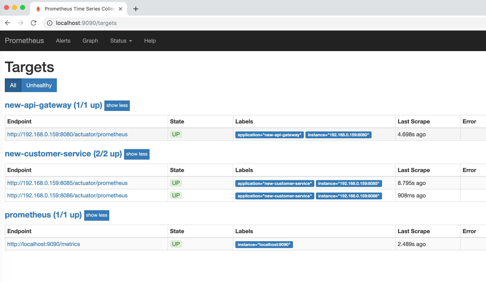

# old-Way

`api-gateway (Zuul)` --> `customer-service` -- `(Hystrix / RibbonClient )` --> `order-service` 

`hystrix-dashboard`

`turbine`

Generate traffic with: 

In `Hystrix Dashboard` configure the following url:

```bash
http://localhost:9090/actuator/hystrix.stream
```

```bash
$ ab -c 5 -n 5000 http://localhost:8080/customer-service/customers/1
```

# new-way

`api-gateway (spring cloud gateway)` --> `customer-service` -- (`Spring Cloud CircuitBreaker`/`Resilience4j` / `Spring Cloud LoadBlancer`) -->
`order-service`

`prometheus`
`grafana`

Generate traffic with: 

```bash
$ ab -c 5 -n 5000 http://localhost:8080/customers/1
```


### Spring Cloud Gateway

Routes available at:

```bash
http://localhost:8080/actuator/gateway/routes
```

Exposed metrics: (`spring.cloud.gateway.metrics.enabled` is set to `true` by default)

```bash
http://localhost:8080/actuator/metrics/gateway.requests
```

These metrics are then available to be scraped from `/actuator/metrics/gateway.requests` and can be easily integated with 
`Prometheus` to create a `Grafana` dashboard.

##### Prometheus

The `management.endpoint.prometheus.enabled` is set to `true` by default.
You need to include `prometheus` to the `management.endpoints.web.exposure.include` 

Then the your application will have the followin endpoint: `http://localhost:8080/actuator/prometheus`.
This will be scraped by [Prometheus](https://prometheus.io/) to get the information from your application. 

##### Grafana

Credentials: `admin`/`password`


Start `Grafana` and `Prometheus` together with `docker-compose` from the `new-way` folder.

```bash
$ docker-compose up
```

Verify that the targets are visible to `Prometheus` at `http://localhost:9090/targets`



You can create your own dashboard, but you can also import already created dashboards like these:

[https://grafana.com/dashboards/4701](https://grafana.com/dashboards/4701)
[https://grafana.com/dashboards/5373](https://grafana.com/dashboards/5373)
[Spring Cloud Gateway]
(https://github.com/spring-cloud/spring-cloud-gateway/blob/master/docs/src/main/asciidoc/gateway-grafana-dashboard.json)


##### `RequestRateLimiter` feature of Spring Cloud Gateway 

Start Redis

```bash
$ docker run --name request-rate-limiter -p 6379:6379 -d redis
```

Demo configuration:

```yaml
filters:
- name: RequestRateLimiter
  args:
  key-resolver: '#{@userKeyResolver}'
  redis-rate-limiter.replenishRate: 2
  redis-rate-limiter.burstCapacity: 2
```

Test it with `ab` tool

```bash
$ ab -v 2 -c 1 -n 3 localhost:8080/customers/1

---
LOG: header received:
HTTP/1.1 200 OK
transfer-encoding: chunked
X-RateLimit-Remaining: 1
X-RateLimit-Burst-Capacity: 2
X-RateLimit-Replenish-Rate: 2
X-Some-Header: foo
Content-Type: application/json;charset=UTF-8
Date: Thu, 13 Jun 2019 08:49:57 GMT
connection: close


LOG: header received:
HTTP/1.1 200 OK
transfer-encoding: chunked
X-RateLimit-Remaining: 0
X-RateLimit-Burst-Capacity: 2
X-RateLimit-Replenish-Rate: 2
X-Some-Header: foo
Content-Type: application/json;charset=UTF-8
Date: Thu, 13 Jun 2019 08:49:57 GMT
connection: close


LOG: header received:
HTTP/1.0 429 Too Many Requests
X-RateLimit-Remaining: 0
X-RateLimit-Burst-Capacity: 2
X-RateLimit-Replenish-Rate: 2
content-length: 0
```
